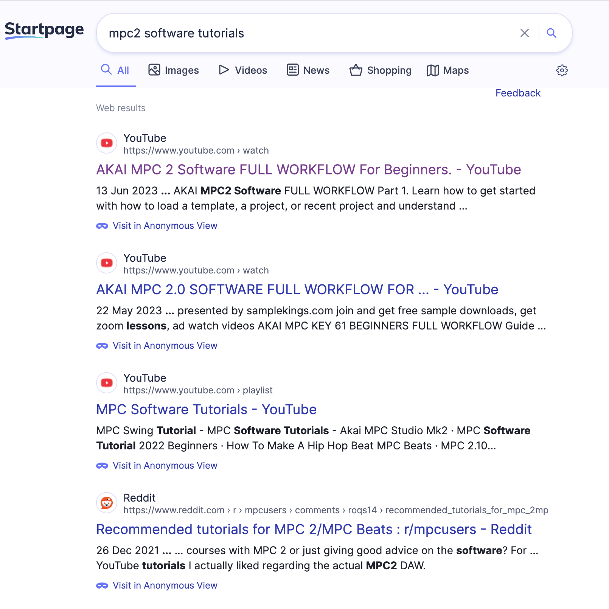

# Langchain Basics og Retrieval-Augmented Generation (RAG)
Denne uges emne handler om at i skal lære at bruge frameworket **LangChain**. I forbindelse med dette kommer vi også mere specifikt ind på hvordan et RAG system er opbygget, hvad indexing betyder, hvad retrieval betyder og hvad Generation betyder, og hvordan disse 3 områder håndteres vha. Langchain.

## Læringsmål
* Forstå hvilke opgaver et framework som Langchain kan udføre.
* Forstå konceptet **RAG**
* Forstå koncepterne **Indexing**, **Retrieval**, **Generation** i en RAG sammenhæng
* Kunne lave basic RAG applikationer med brug af Lanchain og en LLM

## Forberedelse
Se denne video for at få et overordnet ide om hvad Langchain er for et framework:
* [What is LangChain?](https://www.youtube.com/watch?v=1bUy-1hGZpI) (8:07)

Se herefter følgende videoer om mere detaljeret brug af Langchain:    
* [RAG From Scratch: Part 1 (Overview)](https://www.youtube.com/watch?v=wd7TZ4w1mSw) (5:12)
* [RAG From Scratch: Part 2 (Indexing)](https://www.youtube.com/watch?v=bjb_EMsTDKI) (4:51)
* [RAG From Scratch: Part 3 (Retrieval)](https://www.youtube.com/watch?v=LxNVgdIz9sU) (5:13)
* [RAG From Scratch: Part 4 (Generation)](https://www.youtube.com/watch?v=Vw52xyyFsB8) (6:24)

## Dagens indhold
I dag gennemgår vi koden fra de [4 langchain videoer](../materialer/ses6/). Vi vil have fokus på at forklare koden, så i forstår hvad der sker set ud fra et python perspektiv. Vi vil også have fokus på at forklare de langchain koncepter manden snakker om i videoerne.

Vi starter med at kigge på øvelsen fra sidste uge om [Text embeddings](../materialer/ses5/ex-textembeddings/text_embeddings.ipynb)

Herefter går vi videre med vectordatabaser arbejdet med gennem langchain.
Vi tager udgangspunkt i denne kode:

* [Vectorstores - Chroma](https://python.langchain.com/docs/integrations/vectorstores/chroma/)
* [Vectorstores - Chroma - Notebook](../materialer/ses6/chroma.ipynb)

## Materialer
* [What is LangChain?](https://www.youtube.com/watch?v=1bUy-1hGZpI) (8:07)
* [RAG From Scratch: Part 1 (Overview)](https://www.youtube.com/watch?v=wd7TZ4w1mSw) (5:12)
* [RAG From Scratch: Part 2 (Indexing)](https://www.youtube.com/watch?v=bjb_EMsTDKI) (4:51)
* [RAG From Scratch: Part 3 (Retrieval)](https://www.youtube.com/watch?v=LxNVgdIz9sU) (5:13)
* [RAG From Scratch: Part 4 (Generation)](https://www.youtube.com/watch?v=Vw52xyyFsB8) (6:24)

## Øvelser

### Lav din egen applikation 
Den primære øvelse i dag er at du skal finde en ide til hvordan du praktisk kan bruge de elementer vi har været igennem i dag, i dit eget projekt.     
Hvis du sidder uden ide til hvad du skal lave kan du lave de følgende øvelser og tutorials. 

### Search engine Øvelse
Du skal bruge Langchain til denne øvelse.    
Kig på en google (eller anden virksomhed) søgning.    
   
Lav en mockup af de resultater du ser, og lig de nødvendige data i en Vector database.    
Lav herefter en søgning. 

### Lav følgende tutorial    
* [Build a Chatbot](https://python.langchain.com/docs/tutorials/chatbot/).
Du kan evt. downloade tutorialen som [notebook](https://github.com/langchain-ai/langchain/blob/master/docs/docs/tutorials/chatbot.ipynb) og arbejde med den herfra.     
Formålet er ikke at du bare læser den igennem og får den til at køre. Du skal vide hvad der foregår, og helst i så mange detaljer som du magter at sætte dig ind i. 

### Build an LLM RAG Chatbot With LangChain
En mulighed (hvis du har mod på mere) er denne tutorial.

* [Build an LLM RAG Chatbot With LangChain](https://realpython.com/build-llm-rag-chatbot-with-langchain/)

Den er ret omfattende og dækker det vi har været igennem plus lidt mere.